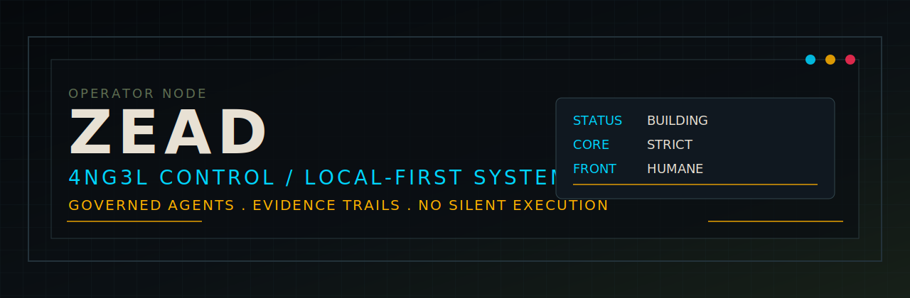
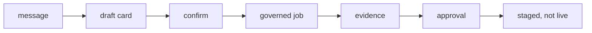

<p align="center">
  
</p>

<p align="center">
  
  
  
  
</p>

# ZEAD // 4NG3L CONTROL

```text
SYSTEM:  LOCAL-FIRST CONTROL PLANE
MODE:    GOVERNED DELEGATION
SIGNAL:  EVIDENCE BEFORE ACTION
STATUS:  BUILDING
```

I build practical control systems for agents, projects, and messy real life.

The current signal is **4NG3L**: a local-first governance layer for delegating
real work without handing the machine to a black box. Natural language in,
structured cards out, risk gates, evidence, worktrees, approvals, and
staged-not-live results. Strict core. Humane front door.

```text
message -> draft -> confirm -> governed job -> evidence -> approval -> staged
```



## // operator

I like systems that are useful before they are impressive:

- local-first tools
- auditable AI workflows
- command palettes and control rooms
- project memory and durable context
- evidence trails over vibes
- automation with brakes
- practical engineering with a little signal glow

No silent execution. No mystery boxes. No pretending the magic is safer than it
is.

<details>
<summary>// console notes</summary>

```text
profile theme : charcoal / cyan telemetry / amber warning lamps
build style   : boring core, sharp interface
threat model  : assume drift, log evidence, keep recovery close
preferred UX  : cards, command palettes, dashboards, operator handles
```

</details>

## // current build

**4NG3L / ANGEL** is the flagship.

It is a delegation board, not a chatbot: a way to turn messy intent into
reviewable work, run bounded workers in isolated spaces, verify what changed,
and keep the operator in the loop.

This repo was used for ANGEL's first supervised real-repo cutover proof, with
no auto-merge or live apply.

```text
strict core       : risk gates / audit log / rollback paths
worker lane       : isolated git worktrees / evidence packets
front door        : conversational router / proposal cards
operator contract : confirm before action / approve before stage
```

## // field notes

Other private labs orbit the same idea: personal operating environments,
evidence engines, local dashboards, strange little tools, games, vehicles, and
systems that should keep working when the demo lights turn off.

The aesthetic is dark paneling, amber warnings, cyan telemetry, workshop dust,
and terminal glass. Cyberdeck energy, but serviceable.

## // rules

```text
build the thing properly
keep it inspectable
log the evidence
make recovery boring
ship useful slices
leave the cockpit cooler than you found it
```

## // signal

```text
agent governance  | local-first tools | project memory
control planes    | evidence systems  | operator UX
garage-lab code   | practical AI      | machines with handles
```
